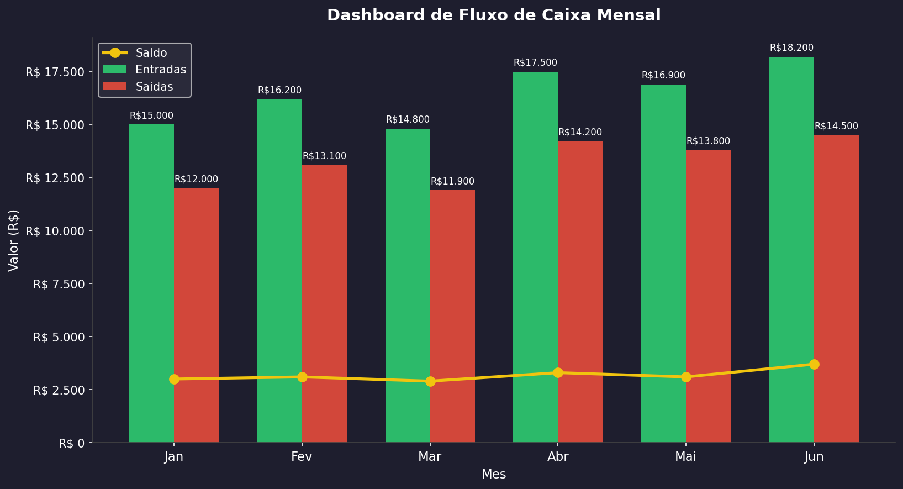

# 📊 Dashboard de Fluxo de Caixa Mensal

## O que é
Script Python que gera um dashboard visual com gráficos de 
entradas, saídas e saldo mensal de fluxo de caixa.

## Por que fiz
Durante 10 anos em controladoria, analisei fluxo de caixa 
manualmente em planilhas. Esse projeto automatiza a visualização 
usando Python, Pandas e Matplotlib.

## Tecnologias
- Python 3.x
- Pandas
- Matplotlib

## Como rodar
```bash
pip install pandas matplotlib
python dashboard.py
```

## Resultado

